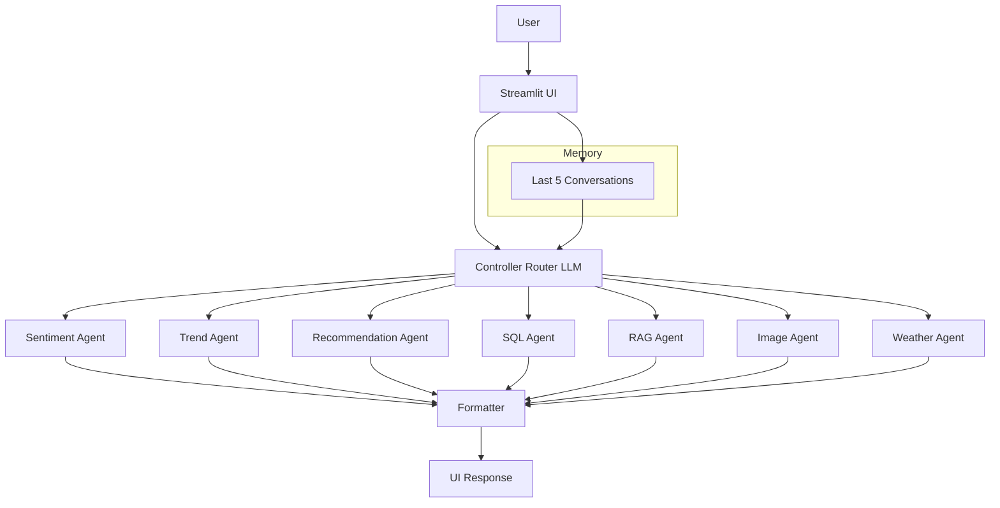
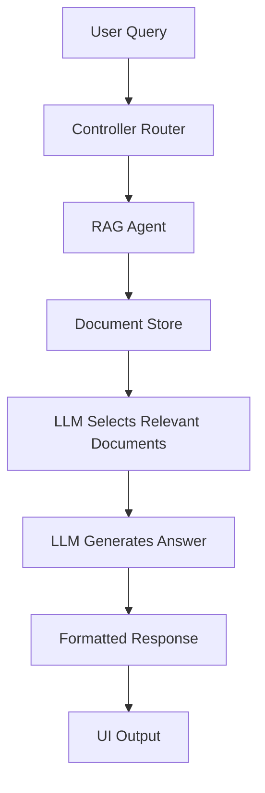
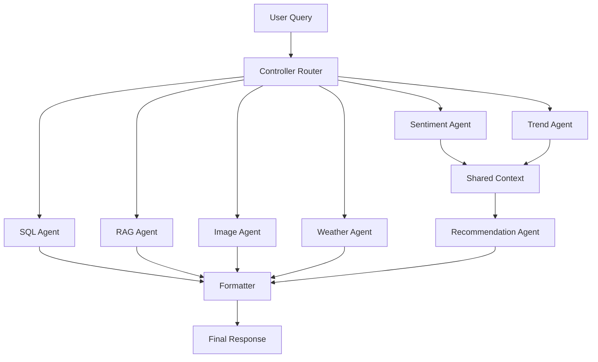

# Multi-Agent AI Assistant with RAG, LLM Routing & Image Generation

## Overview

This project implements a fully integrated multi-agent AI system that combines conversational AI,
document intelligence, structured data querying, and generative capabilities into a single
application. The system is designed to simulate a real-world AI assistant that can process user
queries, route them intelligently, and coordinate multiple specialized agents to generate meaningful
outputs.

---

## Business Use Case: AI-Based Customer Feedback Management System

This system helps small and medium-sized enterprises (SMEs) transform large volumes of customer
feedback into actionable business insights. Organizations often store feedback across documents,
databases, and reports but lack a unified way to extract value from it. This solution demonstrates
how AI can centralize feedback analysis, identify sentiment and trends, answer questions from
internal documents, and even generate visual representations — enabling better decision-making and
faster response to customer needs.

---

## Objectives Achieved

- Conversational interface with limited memory (last 5 exchanges)
- Document-based Question Answering using LLM-based RAG
- Text-to-image generation with prompt engineering
- Multi-agent orchestration through a central controller (Weather, SQL, Recommender)
- LLM-based routing and reasoning
- Fully integrated end-to-end system

---

## Repository Structure

```
NUS-Capstone-Project/
├── app.py                   # Streamlit UI — main application entry point
├── main.py                  # CLI placeholder (see Running the App below)
├── test_llm.py              # Agent integration tests
├── pyproject.toml           # Dependency manifest (managed via uv)
├── output.png               # Sample generated image (image agent output)
├── agents/
│   ├── sentiment_agent.py   # Analyses feedback sentiment from SQLite
│   ├── trend_agent.py       # Identifies recurring issue patterns
│   ├── recommendation_agent.py  # LLM-based actionable recommendations
│   ├── sql_agent.py         # Structured queries on SQLite
│   ├── rag_agent.py         # Document QA via LLM-based retrieval
│   ├── image_agent.py       # Text-to-image via Hugging Face API
│   └── weather_agent.py     # Live weather lookup via OpenWeatherMap
├── controller/
│   └── router.py            # LLM-based query classifier and agent dispatcher
├── data/
│   ├── feedback.db          # SQLite database with sample customer feedback
│   └── documents/           # Static document store for RAG
└── utils/
    └── db.py                # Database helpers (create_table, insert_feedback)
```

---

## Running the Application

### Prerequisites

- Python 3.11+ (see `.python-version`)
- [uv](https://github.com/astral-sh/uv) package manager

### 1. Clone the repository

```bash
git clone https://github.com/vivek-bombatkar/NUS-Capstone-Project.git
cd NUS-Capstone-Project
```

### 2. Install dependencies

```bash
uv sync
```

### 3. Configure API keys

Create a `.env` file in the project root (never commit this file — it is listed in `.gitignore`):

```env
export GROQ_API_KEY=your_groq_api_key_here
export HF_API_KEY=your_huggingface_api_key_here
export OPENWEATHER_API_KEY=your_openweathermap_api_key_here
```

API keys can be obtained from:
- Groq: https://console.groq.com
- Hugging Face: https://huggingface.co/settings/tokens
- OpenWeatherMap: https://openweathermap.org/api

### 4. Launch the app

```bash
uv run streamlit run app.py
```

The app will open in your browser at `http://localhost:8501`.


---

## Gradio App (Alternative UI)

A lightweight Gradio frontend is available at `gradio_app.py` for quick sharing and Hugging Face Spaces deployment.

### Run locally with uv

```bash
uv run python gradio_app.py
```

### What it includes

- Reuses existing `controller.router.handle_query` orchestration
- Supports multi-turn context (last 5 turns)
- Supports document upload + contextual Q&A (RAG over uploaded files)
- Normalizes mixed outputs for chat display:
  - plain text
  - RAG structured payloads
  - `IMAGE_PATH::...` markers

---


### Document-querying (Upload + RAG)

In Gradio, upload one or more documents via the file input and ask questions about them.
The app retrieves relevant chunks from uploaded files and answers using only that context.

**Tip:** Use `.txt` files for best results in this phase.

## Deploy to Hugging Face Spaces (Gradio)

### 1) Create Space

- Go to Hugging Face → **New Space**
- Choose **SDK: Gradio**
- Set visibility/public as needed

### 2) Push code

Push this repository (or deployment branch) to the Space repository.

### 3) Configure secrets

In Space settings → **Variables and secrets**, add:

- `GROQ_API_KEY`
- `HF_API_KEY`
- `OPENWEATHER_API_KEY`

### 4) Launch

Hugging Face will auto-build and run `gradio_app.py` from your repo.

### Optional: create share link locally

For local demos, you can temporarily use:

```python
# in gradio_app.py
gr.ChatInterface(...).launch(share=True)
```

---

## APIs and Libraries

| API / Library | Purpose | Authentication | Fallback Behaviour |
|---|---|---|---|
| Groq (LLaMA 3) | LLM for routing, RAG answers, recommendations, prompt engineering | `GROQ_API_KEY` env var | Returns error message to UI |
| Hugging Face Inference API | Text-to-image generation | `HF_API_KEY` env var | Returns descriptive error; no image rendered |
| OpenWeatherMap API | Live weather data for Weather agent | `OPENWEATHER_API_KEY` env var | Returns "weather unavailable" message |
| SQLite (stdlib) | Structured customer feedback storage | None (local file) | N/A |
| Streamlit | Conversational web UI | None | N/A |
| LangChain (optional) | Prompt templates | None | Prompts constructed manually |

All dependencies are pinned in `pyproject.toml` and locked in `uv.lock`.

---

## Technical Architecture

## Architecture Diagram

The following diagram illustrates the end-to-end flow of the system and how different components interact:




### RAG Architecture




### Multi-Agent Orchestration Flow




---

## Integration Process

This section describes how individual components were developed and integrated into a single end-to-end system.

### Step 1: Independent Agent Development
- Each agent (Sentiment, Trend, Recommendation, SQL, RAG, Image, Weather) was implemented and tested independently
- Focus was on ensuring each agent could handle its specific task reliably

### Step 2: Unit Testing of Agents
- A dedicated test script (`test_llm.py`) was used to validate:
  - LLM connectivity
  - API responses
  - SQL query correctness
  - RAG response quality
- This ensured all agents worked in isolation before integration

### Step 3: Controller (Router) Implementation
- A central controller (`router.py`) was introduced
- LLM-based routing logic was implemented to:
  - Classify user intent
  - Select appropriate agent(s)
- Output format constraints were enforced for consistent agent invocation

### Step 4: Multi-Agent Orchestration
- Agents were connected through the controller
- Dependency flow implemented:
  - Sentiment → Trend → Recommendation
- Outputs from upstream agents were passed as context to downstream agents

### Step 5: UI Integration (Streamlit)
- All agent interactions were connected to a single Streamlit interface (`app.py`)
- Controller became the single entry point for all queries
- No manual switching between components

### Step 6: Memory Integration
- Session-based memory (last 5 interactions) was added
- Memory is passed to the controller for contextual query understanding

### Step 7: End-to-End Testing
- Full system tested using real user queries across:
  - Multi-turn conversations
  - RAG queries
  - SQL queries
  - Image generation
  - Weather queries
- Ensured seamless flow across all components

### Step 8: Error Handling and Stability Improvements
- Added `try/except` blocks across agents
- Implemented fallback responses for API failures
- Added logging for debugging integration issues

---


### Core Architectural Layers

#### 1. Presentation Layer (`app.py`)

- Chat-based UI for user interaction
- Maintains session-level conversational memory (last 5 exchanges = `MAX_MEMORY = 5`)
- Memory is passed as context to the controller on every query
- Displays structured text and generated images
- Acts as the entry point for all user queries

#### 2. Controller Layer (`controller/router.py`)

- Implements LLM-based routing instead of rule-based keyword matching
- Uses Groq LLM to classify user intent dynamically
- Outputs a list of agents to be executed
- Supports multi-agent invocation for complex queries

Routing examples:

| User Query | Agents Invoked |
|---|---|
| "Why are customers unhappy?" | Sentiment → Trend |
| "What should I improve?" | Recommendation |
| "Summarise feedback reports" | RAG |
| "How many complaints this month?" | SQL |
| "Generate a dashboard image" | Image |
| "What is the weather in Singapore?" | Weather |

#### 3. Multi-Agent Layer (`agents/`)

Each agent is independently executable and coordinated through the controller.

**Sentiment Agent** — Analyses feedback stored in SQLite; computes positive/negative/neutral distribution.

**Trend Agent** — Identifies recurring issues using keyword aggregation; detects patterns such as delivery delays or product defects.

**Recommendation Agent** — Consumes outputs from Sentiment and Trend agents; uses LLM reasoning to generate actionable business recommendations. Demonstrates inter-agent context sharing.

**SQL Agent** — Executes structured queries on SQLite; provides numerical insights such as counts and aggregates.

**RAG Agent** — Uses a static document store as the knowledge base; LLM selects relevant documents dynamically and generates grounded answers. See RAG Design section below.

**Image Agent** — Converts user query into an optimised prompt using LLM; calls Hugging Face Inference API for image generation; returns image path for UI rendering.

**Weather Agent** — Accepts a city name extracted from the user query; calls OpenWeatherMap API; returns current conditions and temperature.

#### 4. Data Layer (`data/`)

- SQLite database (`feedback.db`) for structured customer feedback storage
- Static document repository (`data/documents/`) for RAG knowledge base
- Local file storage for generated images

#### 5. Formatter Layer

- Aggregates outputs from multiple agents
- Structures response into labelled sections: Sentiment Analysis, Trends, Recommendations, Data Insights, Knowledge Insights, Visualisation


## Key Implementation Decisions

This section outlines the important architectural and design decisions made while building the system, along with the reasoning behind them.

### 1. LLM-Based Routing vs Rule-Based Routing
- **Decision:** Use LLM (Groq LLaMA 3) for query classification instead of keyword-based rules
- **Reason:** Enables dynamic understanding of user intent and supports complex, multi-intent queries without hardcoding rules
- **Impact:** Improved flexibility and scalability of the controller


### 3. SQLite for Structured Data
- **Decision:** Use SQLite for storing customer feedback data
- **Reason:** Lightweight, no external setup required, and sufficient for prototype-scale structured querying
- **Impact:** Easy portability and fast local testing

### 4. Groq API for LLM Inference
- **Decision:** Use Groq-hosted LLaMA 3 model (`llama3-8b-8192`)
- **Reason:** Faster inference compared to traditional APIs and cost-effective for experimentation
- **Impact:** Improved responsiveness in routing, RAG, and generation tasks

### 5. Streamlit as Primary UI
- **Decision:** Use Streamlit for the main application interface
- **Reason:** Rapid prototyping, built-in support for chat interfaces, and easy deployment
- **Impact:** Faster development and interactive debugging

### 6. Modular Multi-Agent Design
- **Decision:** Implement agents as independent modules under `/agents`
- **Reason:** Separation of concerns and easier testing of individual components
- **Impact:** Improved maintainability and scalability

### 7. Sliding Window Memory (Last 5 Turns)
- **Decision:** Maintain only recent conversation history
- **Reason:** Prevent token overflow and keep context relevant
- **Impact:** Efficient memory usage while preserving conversational continuity


---

## Multi-Agent Coordination

Agents are orchestrated in a dependency-aware pipeline:

```
Sentiment → Trend → Recommendation
```

The Recommendation agent receives the outputs of both prior agents as context, enabling
context-aware reasoning rather than isolated execution.

---

## LLM Integration

The system uses Groq-hosted LLaMA 3 models for:

- Query classification (routing)
- Recommendation generation
- Prompt engineering for image generation
- RAG retrieval and answer generation

Model used: `llama3-8b-8192` (configurable)

---

## RAG Design

### LLM-Based Retrieval

```
Query → LLM reads document list → LLM selects relevant docs → LLM generates grounded answer
```

**What this approach guarantees:**
- Simpler architecture with no additional services
- Answers are grounded in the provided document store (not hallucinated)

---

## Image Generation Design

1. User query is passed to an LLM prompt-engineering step
2. LLM generates a detailed, descriptive image prompt
3. Prompt is sent to Hugging Face Inference API (`stabilityai/stable-diffusion-2`)
4. Generated image is saved locally as `output.png` and rendered in the UI

### Prompt Experimentation

To improve image generation quality, multiple prompt variations were tested and compared.

#### 1. Basic Prompt (Low Detail)
- **Input:** "Generate a dashboard showing customer satisfaction trends"
- **Output:** Generic chart with minimal structure and poor visual clarity

#### 2. Enhanced Prompt (Moderate Detail)
- **Input:** "A dashboard with bar charts showing customer satisfaction trends over time"
- **Output:** Improved layout with visible charts, but still lacking professional styling

#### 3. Engineered Prompt (High Detail)
- **Input:** 
  "A clean modern data dashboard with bar charts and line graphs showing customer satisfaction scores over 12 months, blue and white colour scheme, professional UI, high resolution"
- **Output:** High-quality, structured, and visually appealing dashboard with clear data representation

#### Key Learnings
- More descriptive prompts significantly improve output quality
- Including visual style (e.g., colour scheme, layout) enhances realism
- Adding context (e.g., time range, data type) leads to more meaningful images

---

## Conversational Memory

The system maintains a sliding window of the last 5 user/assistant exchange pairs:

```python
MAX_MEMORY = 5
# Only the last MAX_MEMORY * 2 messages are kept in session state
```

This context is serialised and passed to the controller on every query, enabling follow-up
questions that reference earlier turns. Memory is session-scoped (resets on page reload).

---

## Challenges and Solutions

| Challenge | Solution |
|---|---|
| FAISS / Torch / ChromaDB incompatibility on macOS Intel | Replaced with LLM-based document retrieval |
| Hugging Face model deprecations and permission errors | Switched to `stabilityai/stable-diffusion-2`; added fallback error handling |
| Unicode characters from LLM causing API failures | Applied ASCII sanitisation to all LLM outputs before downstream API calls |
| Agent coordination lacking context flow | Introduced structured pipeline: Sentiment → Trend → Recommendation with shared context |
| LLM routing inconsistency on ambiguous queries | Improved system prompt with explicit routing examples and output format constraints |

---

## Debugging and Testing

### Testing Approach

Each agent was tested in isolation before integration using `test_llm.py`:

```bash
python test_llm.py
```

The test script covers:
- LLM connectivity (Groq API round-trip)
- SQL agent query execution and result formatting
- RAG agent document selection and answer generation
- Image agent prompt engineering and API response handling
- Controller routing accuracy on sample queries

### Integration Testing

End-to-end flow was validated manually via the Streamlit UI with the following test queries:

| Test Query | Expected Agent(s) | Verified |
|---|---|---|
| "Why are customers unhappy?" | Sentiment + Trend | ✅ |
| "What should I improve?" | Recommendation | ✅ |
| "Summarise issues from reports" | RAG | ✅ |
| "How many complaints last month?" | SQL | ✅ |
| "Generate a dashboard image" | Image | ✅ |
| "What is the weather in Singapore?" | Weather | ✅ |

### Debugging Approach

- Isolated each agent with print-based logging before wiring to controller
- Added API response logging to surface model errors vs. network errors
- Introduced `try/except` with fallback messages at every agent boundary to prevent silent UI failures

---

## Improvements Implemented

- Replaced rule-based routing with LLM-based routing for better generalisation
- Introduced inter-agent context sharing (Sentiment/Trend → Recommendation)
- Improved output formatting with labelled sections per agent
- Added prompt engineering step for image generation quality
- Implemented robust error handling with user-visible fallback messages
- Added ASCII sanitisation to prevent encoding errors in API calls

---

## Known Limitations

- RAG uses LLM-based document selection rather than true vector similarity retrieval
- Memory is session-scoped only; no persistence across sessions
- Image generation latency depends on Hugging Face API queue times (free tier)
- Weather agent requires a valid city name; ambiguous location queries may fail

---

## Future Enhancements

- Integrate vector databases (FAISS or Pinecone) once dependency constraints are resolved
- Improve RAG with document chunking and embedding-based retrieval (e.g., `sklearn` TF-IDF)
- Add persistent memory via a database backend
- Deploy on Hugging Face Spaces or Streamlit Cloud
- Introduce a feedback learning loop where user corrections improve routing accuracy
- Add authentication and multi-user session management

---

## Example Interactions

### Customer Insight Analysis

```
User:  Why are customers unhappy?
System: [Sentiment] 62% negative, 28% neutral, 10% positive
        [Trends] Top issues: delivery delays (34%), product defects (21%)
        [Recommendations] Priority actions: ...
```

### Document QA

```
User:  Summarise issues from the Q3 report
System: [Knowledge] Based on internal documents: The Q3 report highlights...
```

### Image Generation

```
User:  Generate a dashboard showing satisfaction trends
System: [Image] <rendered image>
```

### Weather

```
User:  What is the weather in Singapore?
System: [Weather] Singapore: partly cloudy, 31°C, humidity 82%
```

---

## Conclusion

This project demonstrates how multiple AI capabilities can be integrated into a cohesive,
production-style prototype. It uses LLMs not just for generation, but for orchestration,
reasoning, and decision-making. The system reflects real-world AI architecture patterns and shows
how practical constraints (dependency conflicts, API instability) can be addressed through
adaptive design choices without compromising the functional requirements.

---

## Final Status

| Capability | Status |
|---|---|
| Conversational interface with memory | ✅ Implemented |
| Document QA (LLM-based RAG) | ✅ Implemented |
| Text-to-image generation | ✅ Implemented |
| Multi-agent orchestration (Weather, SQL, Recommender) | ✅ Implemented |
| LLM-based routing | ✅ Implemented |
| Streamlit UI integration | ✅ Implemented |
| End-to-end executable prototype | ✅ Implemented |
